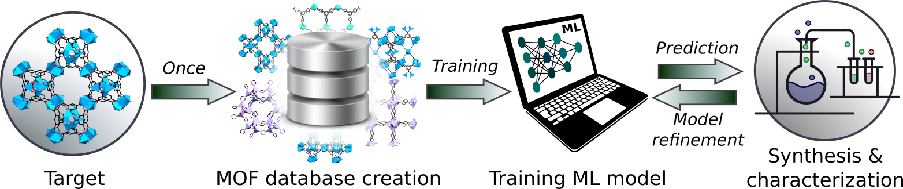

# Machine Learning Based MOF Synthesis Prediction

# Paper
**MOF Synthesis Prediction Enabled by Automatic Data Mining and Machine Learning**  
Yi Luo, Saientan Bag, Orysia Zaremba, Jacopo Andreo, Stefan Wuttke, Pascal Friederich, and Manuel Tsotsalas  
*Basque Center for Materials, Applications & Nanostructures*  
*Karlsruhe Institute of Technology*

# Contact
- Machine learning: saientan.bag9@kit.edu, pascal.friederich@kit.edu

# Requirements
- python 3.x
- Tensorflow 2
- RDKit
- Scikit-Learn

# Data
- All data required to train the models is contained in this repository.
- The latest version of the full SynMOF database can be found on:
https://github.com/Tsotsalas-Group/MOF_Literature_Extraction
- Contact for SynMOF database: manuel.tsotsalas@kit.edu

# Machine Learning
- All python scripts can be found in the code directory
- The random forest models described in the paper can be trained using the pyhthon scripts found in the code directory
- The scripts to generate learning curves can be found in the temperature subdirectory of the RAC features

# Expert quiz
- The jupyter notebook (compatible with google colab) can be found in the quiz directory
- In addition, there is a pdf printout of the expert quiz, as well as the data.zip directory required to run the quiz

